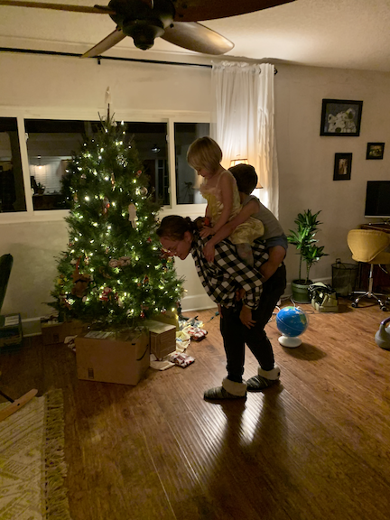

# 2020
I'm not sure how the hell you even start writing a reflection about 2020. This year seems to have crystallized the trope that time moves simultaneously too quickly and too slowly&mdash;twelve months having both passed by in a blur and happened so long ago that I can't hardly remember what was happening in the world. The Democratic primary was in full swing, Kobe Bryant and his daughter died in a helicopter crash, and Australia was on fire. China finally started talking about the virus that was about the change the world. Since, we lived on through the death of George Floyd, the protests that followed, and the election of Joe Biden.

Now I've worked more from home for my new job than at the office. It's been a full year since I've seen my family back in Austin. My wife and I became home owners for the first time, moving out of a house we shared with our close friends for the last four years, with all of the feelings that entails. We pulled our kids out of public school, tried to go back, then pulled them out again. And one close friend and my mother-in-law are both fighting off the tail-end of COVID this Christmas morning. My wife's grandfather and his brother both fell victim to the disease and to Poland's lax response.

Of course, none of my big quarantine plans came to fruition: I don't have my morning routine down, probably meditated less often than I did before, and have zero new artistic or intellectual skills to show off. I started seeing a therapist, so that's a mark in the positive column (I think?).

What do you take away from a year that has already taken so much? The Buddhist in me wants to write about the non-toothache that 2021 will bring&mdash;how wonderful it will feel to simply hug a friend, or have indoor movie nights all snuggled together on the sofa, how the alien feeling of 2020 will wear off and fade as life slowly merges back into normalcy. "Oh my god, do you remember when...?" won't quite bring back the drudgery of isolation, the seeming endless march of weekends stuck with only ourselves for company. This longing for our fellow humans will finally be fulfilled, and then it will disappear.

Maybe that's what I'll take, that ache that air-hugs leave behind, that sense that we never really finished saying goodbye&mdash;or hello for that matter&mdash;close friends being forced to act as if they're on the front steps after a first date, awkwardly figuring out if they are invited up or not only to realize, the moment has come and gone, and it's time to leave. In 2021, after the vaccine has run its course through the body politic, when it comes time leave the (inside!) table, I'll wait just an extra few seconds or so, remembering what it was like having to simply give a little half-wave-have-shrug and verbal "awww thanks so much" and then turn around and leave. After this has been firmly brought to mind, I will _fly_ into the arms of my dearest friends with every burst of pent up joy and affection I have been saving all these sad, long, short months.

Merry Christmas, and a Damn. Happy. _New_. (!!!) Year!

